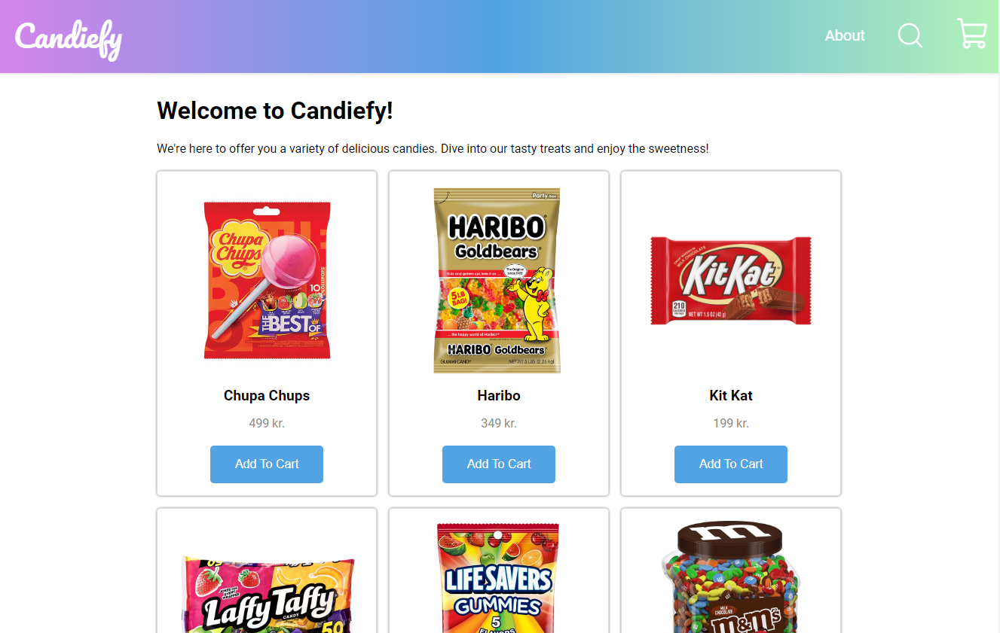

# Candiefy

This is a simple e-commerce website built with React JS and CSS. It features a user-friendly interface for browsing products, managing a shopping cart, and completing the checkout process with ease.

This project was developed by following the tutorial "React Shopping Cart Ecommerce Beginner Website" by 
PedroTech. The tutorial provided comprehensive guidance on building an e-commerce website using React and CSS.

You can find the original tutorial here: https://www.youtube.com/watch?v=tEMrD9t85v4&t=3633s

